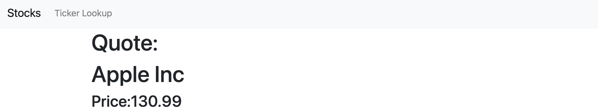

# StockLookup
Run project in virtual environment, https://uoa-eresearch.github.io/eresearch-cookbook/recipe/2014/11/26/python-virtual-env/ for setup.

Django,Requests must also be installed.

Project is web based application that can look up information about stocks in the various stock markets. 
Lookup is based on symbol(ticker) for each company.

